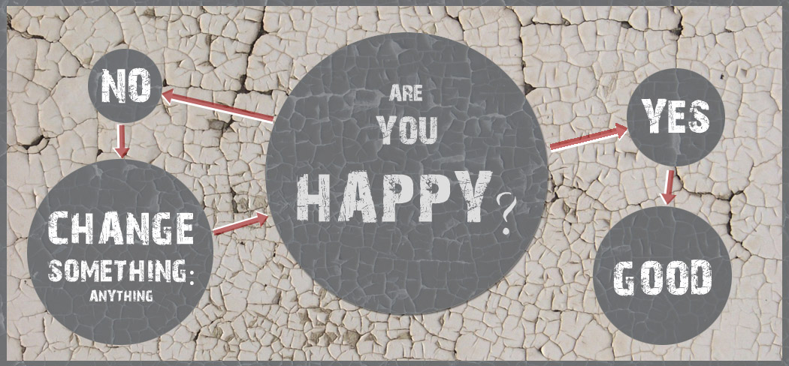

# Applied Data Science @ Columbia
## Fall 2018
## Project 1: What made you happy today?



### [Project Description](doc/)

Term: Fall 2018

+ Projec title: The happy moment for different people
What did they write? What makes them happy today?
+ This project is conducted by Yang Chen, YC3335

+ Project summary: I conduct a brief study on different people have various demographic characteristics to find out what make them feel happy. This study used text minning techniques, analyze keywords and sentiments and topic divide. The results showed that mostly people feel happy from their friends and family members, however, people with different demographic characteristics have relatively different factor to make them happy.


### [Project Report](https://cdn.rawgit.com/spandcy/ADS_project1/3b2f8d90/output/Project1_report_yc3335.html)

### [Project Code](doc/Project1_report_yc3335.Rmd)

Following [suggestions](http://nicercode.github.io/blog/2013-04-05-projects/) by [RICH FITZJOHN](http://nicercode.github.io/about/#Team) (@richfitz). This folder is orgarnized as follows.

```
proj/
├── lib/
├── data/
├── doc/
├── figs/
└── output/
```

Please see each subfolder for a README file.
